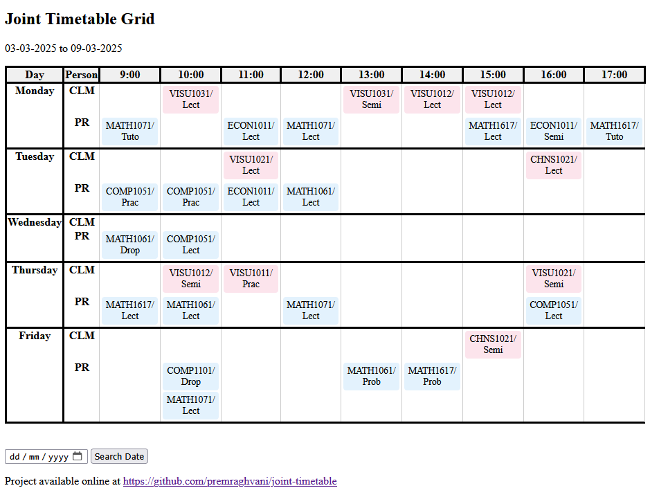
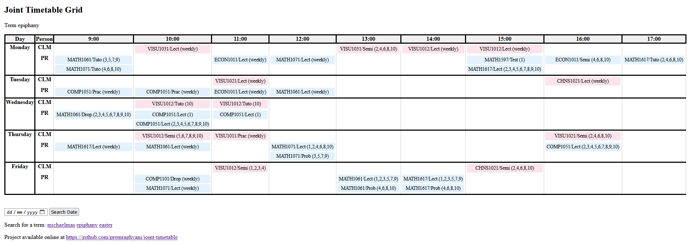

# Preamble and pre-requisites

So, at university me and a few friends wanted to have a joint calendar - so why not have it dynamic.

Durham University allows an ical export, and some other unis may. This is a pre-requisite for this.
This therefore works for Durham University (at least for academic year 2025-26, it won't be changed after 2027 when I graduate,
so lets hope CIS / Student Registry don't change things around!) This tool is **not** associated or endorsed by Durham University.

This project can work locally, or in AWS Lambda.

You must have NodeJS installed. This was developed in v20.11.0, but should work in v20 or later - unsure about prior versions of node.
You must also have npm installed.

# Download and Run

## Locally

1. `npm install` to install dependencies.

2. Configure - check below in the config section

3. `node local.js` to run locally. By default, it will run on port `3030`.
To change this, please go to line one of `local.js` and change the port - it is common sense where

## AWS Setup

Please refer to [AWS set up docs](setupaws.md)

# Config

The `config.json` file looks like:
```json
{
    "people":{
        "personOne":"[LinkToICS]"
    },
    "terms":{
        "michaelmas":{
            "start":"07-10-2024",
            "end":"13-12-2024"
        }
    }
}
```
## People (Calendars)

As an example, `personOne` is the key (so the person name displayed), and `[LinkToICS]` is their corresponding string, which is an `.ics` calendar (`.ical`) is accepted. Must be a web calendar.
Add rows underneath this `personOne` for other people. **A maximum of 10 people are permitted. A minimum of 1 person is required** 

## Terms

As an example, `michaelmas` is the key (so the term name displayed), and we have an object corresponding to it, with a `start` date and an `end` date, both
must be in `DD-MM-YYYY`. Note that only Mondays to Fridays are displayed.
Add rows underneath this `michaelmas` for other terms. **A minimum of 1 term is required**

# Sample

Example (single week)


Example (term)

